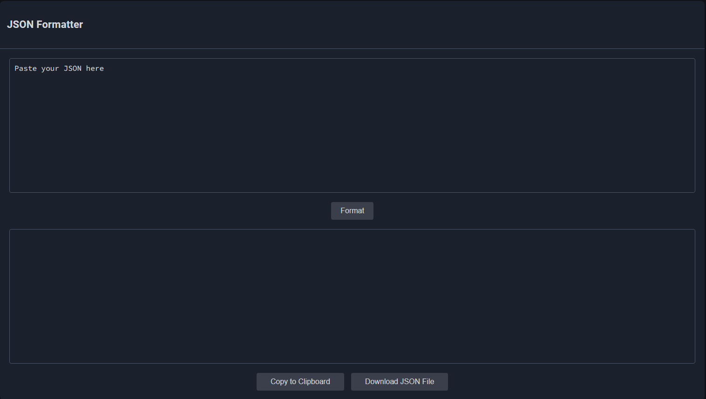

# JSON Formatter

## Overview
The JSON Formatter restructures improperly formatted JSON into valid JSON. It includes features to download the formatted output as a `.json` file or copy it directly to the clipboard for easy use.

---

## Features
- Copy to clipboard button
- Download as .json file
- User intuitive design
- Responsive UI
---

## Usage

### Web Tool:
1. Paste your JSON into the input box.
2. Click the "Format" button.
3. Click the "Copy to Clipboard" button to copy output.
4. Click the "Download JSON File" button to download output as a `.json` file.

---

## Tutorial

### Formatting a JSON File
1. Open the Backend Buddy developer toolkit.
2. Click on the "JSON Formatter button on the left side panel.
3. Type, or paste your improperly formatted JSON into the text box labeled "Paste your JSON here".
	- E.g., ``{
  "name": "John Doe",
  "age": 30,
  "email": "john.doe@example.com",
  "isActive": true,
  "addresses": [
    {"type": "home", "city": "New York" "state": "NY"},
    {"type": "work", "city": "San Francisco", "state": "CA"}
  ],
  hobbies: ["reading", "gaming", "cycling"]
}``

4. Click on the "Format JSON" button.
5. Either copy or download the output.
---

## Troubleshooting
Address common issues and how to resolve them.

**Example:**
### Common Errors
- **Error:** "Error: Unexpected token '', "..." is not valid JSON"
  - **Solution:** Check that your JSON is properly formatted before passing it to the tool.
- **Error:** "Nothing to copy!"
	- **Solution:** Ensure there is something in the output field by formatting JSON.
- **Error:** "No JSON to download!"
	- **Solution:** Ensure there is something in the output field by formatting JSON.

---